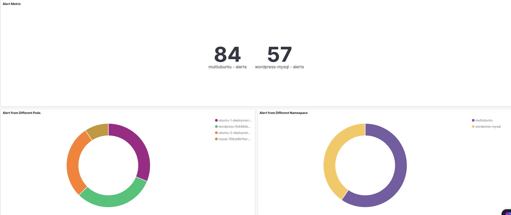
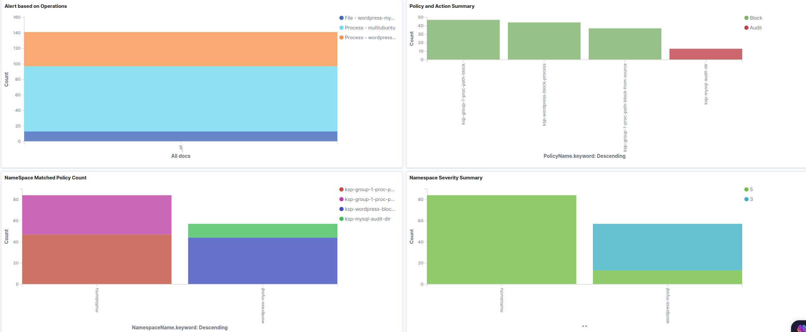

# kubearmor-elasticstack-logging


## Elastic Stack Visualisation
Users can modify the relay server to include support for Elastic Stack Dashboards. This integration enables efficient indexing, search, and visualization of the large volumes of log data generated by the relay server.

There would be 2 additional components along with the Relay server:

1. **Elasticsearch** is a real-time, distributed, and scalable search engine which allows for full-text and structured search, as well as analytics. Relay server logs can be indexed and searched through which would be produced in large volumes of log data.


2. **Kibana** is a data visualization frontend and dashboard for Elasticsearch. Kibana allows user to explore the log data in a visual manner that is stored in the Elasticsearch instance with the help of a web interface. Users would also be allowed to build dashboards or view existing ones which would help to answer and quickly gain insight about the pods managed by KubeArmor:

- Alert Metric
- Alert from Different Pods
- Alert from Different Namespace 
- Alert based on Operations
- Policy and Action Summary 
- NameSpace Matched Policy Count
- Namespace Severity Summary
- Alert Based on Tags

Kibana will be a part of deployment , while  ElasticSearch will be a part of StatefulSet that can run in any node

```
kubectl apply -f deployments/ek-dashboards
```

For the log data to be sent to elasticsearch, change the values of ```ENABLE_DASHBOARDS``` in ```deployments/relay-deployment.yaml>spec>template>spec>container>env``` to ```true``` , it should look like 

```
    .......

      containers:
      - name: kubearmor-relay-server
        image: kubearmor/kubearmor-relay-server:latest
        env:
          - name: ENABLE_DASHBOARDS
            value: "true"
    .......

```
Apply the changes in relay-server with 

```
kubectl apply -f deployments/relay-deployment.yaml
```

To View the DashBoards

* Portforward the Kibana service
```
kubectl port-forward deployment/kibana -n default 5601:5601
```
* Open up a browser and go to [localhost:5601](localhost:5601)
* Go to sidebar and open ``Management`` -> ``Saved Objects`` -> ``Import``

Drag and drop the file from ```res/export.ndjson```

* Go to ``Dashboard`` section , selct ``KA``

* The visualization should be ready !!

Here are some example visualization with [multiubuntu](https://github.com/kubearmor/KubeArmor/blob/main/examples/multiubuntu.md) and [wordpress-mysql](https://github.com/kubearmor/KubeArmor/blob/main/examples/wordpress-mysql.md) example





